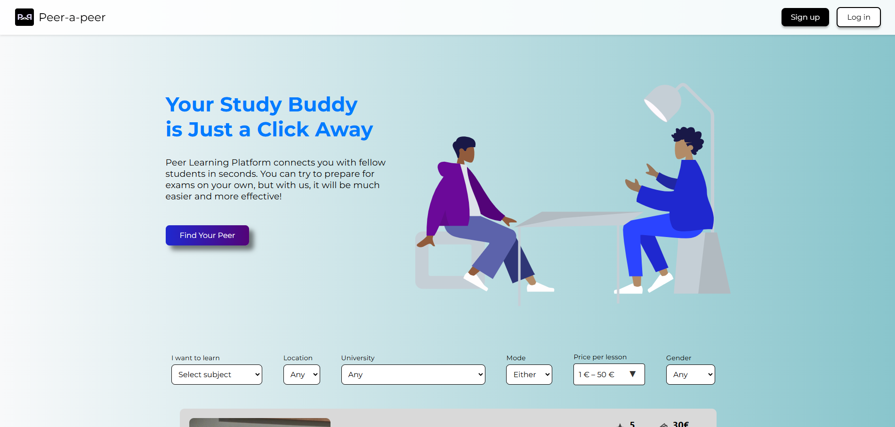
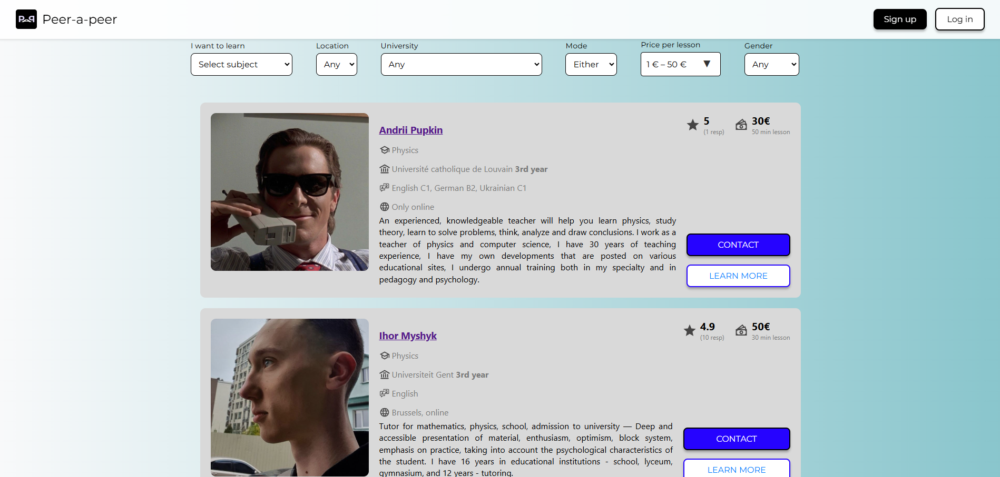

# PEER-tutoring-platform
A full-stack web application for peer-to-peer tutoring among university students preparing for exams. Built with Django and React


# Frontend

Фронтенд для платформи Peer-To-Peer створено за допомогою фреймворку React.

<div style="display: flex; justify-content: center; gap: 20px; align-items: center;">
  
  
</div>

## Зміст

1. [Особливості](#особливості)
2. [Структура файлів](#структура-файлів)
3. [Компоненти](#компоненти)
4. [Тести](#тести)
5. [Встановлення та запуск](#встановлення-та-запуск)
6. [Додаткові примітки](#додаткові-примітки)

## Особливості

- **Реєстрація за ролями**: Користувачі можуть реєструватися як студенти або репетитори з різними етапами реєстрації.
- **Динамічне фільтрування**: Репетиторів можна відфільтрувати за предметами, місцем розташування, діапазоном цін та іншими критеріями.
- **Інтерактивні форми**: Покрокові форми реєстрації з перевірками та управлінням станом.
- **Адаптивний дизайн**: Компоненти стилізовані для забезпечення плавного досвіду на різних пристроях.
- **Кастомні компоненти**: Такі компоненти, як `RangeSlider` та `FilterBox`, розроблені спеціально, щоб відповідати стилістиці та необхідному функціоналу проєкту.
- **Тестування**: Наразі часткове тестове покриття за допомогою Jest та React Testing Library.

## Структура файлів

Основні компоненти та файли тестів організовані наступним чином:
```text
src/ 
├── components/
    ├── Button.js
    ├── FilterBox.js 
    ├── LogInForm.js
    ├── MainForm.js 
    ├── Navbar.js
    ├── RoleSelection.js
    ├── StepProgress.js
    ├── StudentForm.js
    ├── TutorFormStep.js 
    ├── TutorSection.js 
    ├── TutorUniversityStep.js 
    └── RangeSlider.js 
├── styles/ │ 
    └── (CSS модулі для кожного компонента) 
├── assets/ │ 
    └── (Зображення та іконки для UI) 
├── tests/ │ 
    ├── LogInForm.test.js │ 
    ├── StudentForm.test.js │ 
    ├── TutorFormStep.test.js 
    └── TutorUniversityStep.test.js
```

## Компоненти

### Основні компоненти

1. **LogInForm**: Обробляє вхід користувача з перевіркою email та пароля і інтеграцією з бекендом для аутентифікації.
2. **MainForm**: Покрова форма реєстрації для студентів та репетиторів.
3. **FilterBox**: Динамічна система фільтрації для вибору репетиторів за вподобаннями користувача.
4. **TutorSection**: Відображає список репетиторів із пагінацією та фільтруванням.
5. **RoleSelection**: Дозволяє користувачам вибрати свою роль (Студент або Репетитор) під час реєстрації.
6. **RangeSlider**: Кастомний слайдер для вибору діапазону цін.

### Додаткові компоненти

- **Navbar**: Верхнє меню з посиланнями на сторінки реєстрації та входу.
- **StepProgress**: Відображає прогрес багатокрокових форм.

## Тести

Для забезпечення стабільності та надійності платформи реалізовані наступні тести:

1. **LogInForm.test.js**
   - Тестує рендеринг форми, успішний вхід і обробку помилок (наприклад, неправильні облікові дані, помилки мережі).

2. **StudentForm.test.js**
   - Перевіряє обов’язковість полів форми та обробляє відправлення з API-відповідями.

3. **TutorFormStep.test.js**
   - Тестує правильний рендеринг, навігацію між етапами та перевірку помилок.

4. **TutorUniversityStep.test.js**
   - Імітує завантаження файлів, вибір із випадаючих списків та сценарії відправлення форми.

## Встановлення та запуск

### Вимоги

Встановіть:

- Node.js (v20 або новішої версії)
- npm
- Файл `.env` із налаштуванням `REACT_APP_BASE_URL`, яке вказує на базовий URL бекенду.

### Встановлення

1. Клонуйте репозиторій:
   ```bash
   git clone <https://github.com/StrivingToAdoniss/PEER-tutoring-platform.git>
   cd <repository-folder>
   ```

2. Встановіть залежності:

    ```bash
    npm install
    ```

3. Запустіть застосунок:
    ```bash
    npm start
    ```
4. Запустіть тести:
    ```bash
    npm test
    ```

## Додаткові примітки
- Застосунок підтримує завантаження файлів для фотографій профілю та сертифікаційних документів, які попередньо переглядаються перед відправкою.
- Усі форми перевіряються на повноту та правильність перед переходом на наступний етап або відправленням.
- Використовуйте .env для налаштувань, специфічних для середовища.


## To do

- **SpecializationSelector**: Дозволяє користувачам вибирати спеціалізації для вибраних предметів.