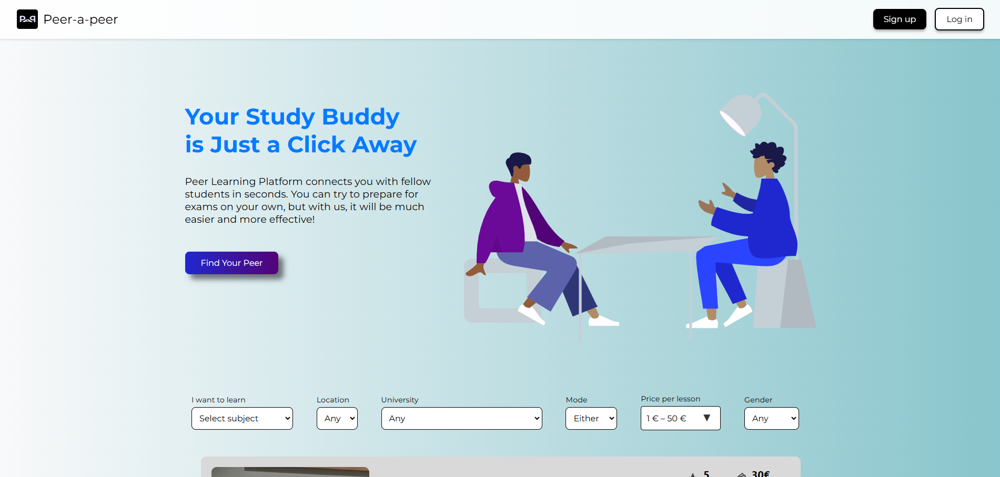
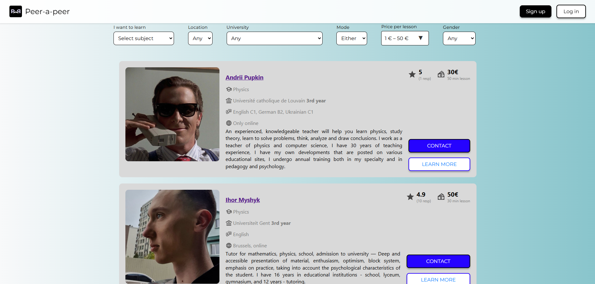

# Наша команда 

1. **Тимошенко Андрій, ІМ-22**  
   **Роль**: бекенд розробник та DevOps  
   **Обов'язки**: розробка бекенду, девопс (Docker, CI, Nginx).

2. **Олександр Горовий, ІМ-22**  
   **Роль**: фронтенд розробник на React  
   **Обов'язки**: розробка фронтенду, написання тестів.


# PEER-tutoring-platform
A full-stack web application for peer-to-peer tutoring among university students preparing for exams. Built with Django and React


# Frontend

Фронтенд для платформи Peer-To-Peer створено за допомогою фреймворку React.

<div style="display: flex; justify-content: center; gap: 20px; align-items: center;">
  
  
</div>

## Компоненти

### Основні компоненти

1. **LogInForm**: Обробляє вхід користувача з перевіркою email та пароля і інтеграцією з бекендом для аутентифікації.
2. **MainForm**: Покрова форма реєстрації для студентів та репетиторів.
3. **FilterBox**: Динамічна система фільтрації для вибору репетиторів за вподобаннями користувача.
4. **TutorSection**: Відображає список репетиторів із пагінацією та фільтруванням.
5. **RoleSelection**: Дозволяє користувачам вибрати свою роль (Студент або Репетитор) під час реєстрації.
6. **RangeSlider**: Кастомний слайдер для вибору діапазону цін.

### Додаткові компоненти

- **Navbar**: Верхнє меню з посиланнями на сторінки реєстрації та входу.
- **StepProgress**: Відображає прогрес багатокрокових форм.

## Виористання GoF патернів

**LogInForm**

Facade: замість прямого axios викликає ApiFacade.login(...) для аутентифікації.

Decorator: обгорнуто в withLogger (логування пропсів) і може бути обгорнуто в withErrorBoundary (фолбек при помилці).

**MainForm**

Observer: публікує зміни кроків (stepChange, totalStepsChange) у EventBus.

Factory Method: рендерить різні селектори через єдиний SelectorFactory за ключем type.

**FilterBox**

Decorator: обгорнуто в withLogger для централізованого логування пропсів.

**TutorSection**

Facade: отримує список репетиторів через ApiFacade.fetchTutors(...).

Decorator: обгорнуто в withLogger.

**RoleSelection**
Factory Method: інтегрується через SelectorFactory як випадок type="role".

# Backend

## Функціонал
- **Система авторизації та автентифікації** за допомогою JWT.
- **Оптимізована база даних** для ролей користувачів (Тютори та Студенти) через використання проксі-моделей, оптимізацію запитів для уникнення N+1 проблеми та пагінацію.
- **Тютори мають проходити затвердження адміном** перед доступом до системи. Процес апруву реалізовано через email-сповіщення з можливістю схвалення або відхилення заявки.
- **Фільтри для пошуку тюторів** за університетом, спеціальністю, ціною за годину тощо.
- ** Тютори можуть редагувати свій профіль, змінюючи інформацію про ціну занять, локацію тощо.
- ** Створення профіля для тютора та студента та управління ним
- **  Можливість оцінювати тютора для студента

---


## Proxy Pattern

**Проблема:**  
- Є єдина таблиця `User`, але треба дві «рольові» сутності — `Student` і `Tutor` — з різним API й поведінкою, без дублювання колонок чи зайвих JOIN-ів.

**Імплементація:**  
1. Створені proxy-класи:  
   ```python
   class Student(User):
       class Meta:
           proxy = True
       objects = StudentManager()  # фільтр role='STUDENT'

   class Tutor(User):
       class Meta:
           proxy = True
       objects = TutorManager()   # фільтр role='TUTOR'
   
- Менеджери переопрацьовують `get_queryset()`, додаючи `WHERE role=…`.
- У `save()` проксі автоматично встановлюють правильний `role`.

**Результат:**

- Жодного дублювання таблиць — усі користувачі в єдиній.
- `Student.objects.all()` повертає лише студентів, `Tutor.objects.all()` — лише репетиторів.
- Чистий код без розкиданих `if user.role == …` у бізнес-логіці.

**Посилання:**
- https://github.com/StrivingToAdoniss/PEER-tutoring-platform/blob/main/backend/accounts/models.py

## Factory Method Pattern

**Проблема:**

- Логіка створення й оновлення профілів різних типів (студентів vs репетиторів) розпорошується по в’юхах і серіалізаторах через `if/else`, що призводить до:
  - дублювання валідацій,
  - дублювання кроків присвоєння полів,
  - складності додати новий тип профілю.

**Імплементація:**

- Strategy-інтерфейс із методами `validate(data)` та `fill(profile, data)`.
- Конкретні стратегії: `TutorProfileStrategy`, `StudentProfileStrategy`.
- ProfileFactory:
  ```python
  strat = STRATEGIES[data['profile_type']]
  strat.validate(data)
  strat.fill(profile, data)
  profile.save()
  ```
- Виклик фабрики в серіалізаторах (`.create()`/`.update()`) та в’юхах (`serializer.save()`).

**Результат:**

- Єдина точка створення/оновлення профілів.
- Жодного розкидання `if/else` у контролерах.
- Легке додавання нових типів профілів через нову стратегію.

**Посилання:**
- https://github.com/StrivingToAdoniss/PEER-tutoring-platform/blob/main/backend/profiles/services.py
- https://github.com/StrivingToAdoniss/PEER-tutoring-platform/blob/main/backend/profiles/serializers.py
- https://github.com/StrivingToAdoniss/PEER-tutoring-platform/blob/main/backend/profiles/views.py

## Observer Pattern

**Проблема:**

- Потрібно автоматично оновлювати середній рейтинг репетитора при створенні, зміні чи видаленні відгуків.
- Без Observer довелося б дублювати виклики перерахунку в кожному CRUD-методі.

**Імплементація через Django-сигнали:**

- Використовуються сигнали `post_save` та `post_delete` для моделі `Review`.
- Функція-обробник:
  ```python
  @receiver(post_save, sender=Review)
  @receiver(post_delete, sender=Review)
  def update_profile_rating(sender, instance, **kwargs):
      avg = instance.profile.reviews.aggregate(Avg('rating'))['rating__avg'] or 0
      instance.profile.save(update_fields=['average_rating'])
  ```
- Підключення сигналів у `apps.py`, щоб Django їх «побачив».

**Результат:**

- Рейтинг перераховується автоматично — без ручних викликів у в’юхах.
- Легка підписка нових обробників (сповіщення, логування) на ті ж події.

**Посилання:**
- https://github.com/StrivingToAdoniss/PEER-tutoring-platform/blob/main/backend/reviews/signals.py

---

**Коротко:**

- **Observer:** підписка-сповіщення про події через сигнали.
- **Proxy:** сурогат моделі з тим самим інтерфейсом, але з фільтрацією/контролем, без окремих таблиць.
- **Factory:** централізоване створення об’єктів із вибором реалізації та валідацією через стратегії.


## Запуск проекту
1. Заповніть `.env` файл необхідними даними.
2. Запустіть проект командою:

    ```bash
    docker-compose up --build
    ```

