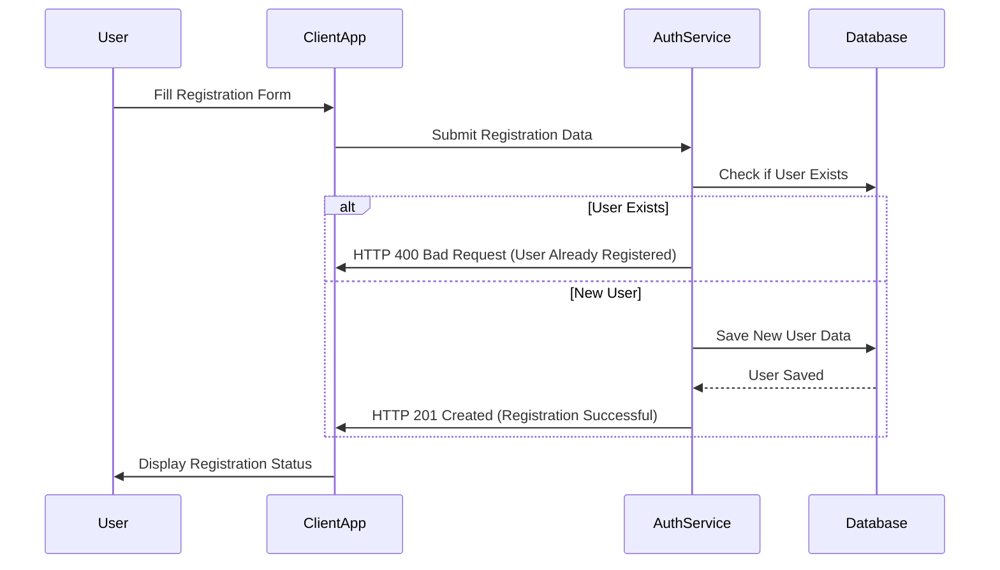
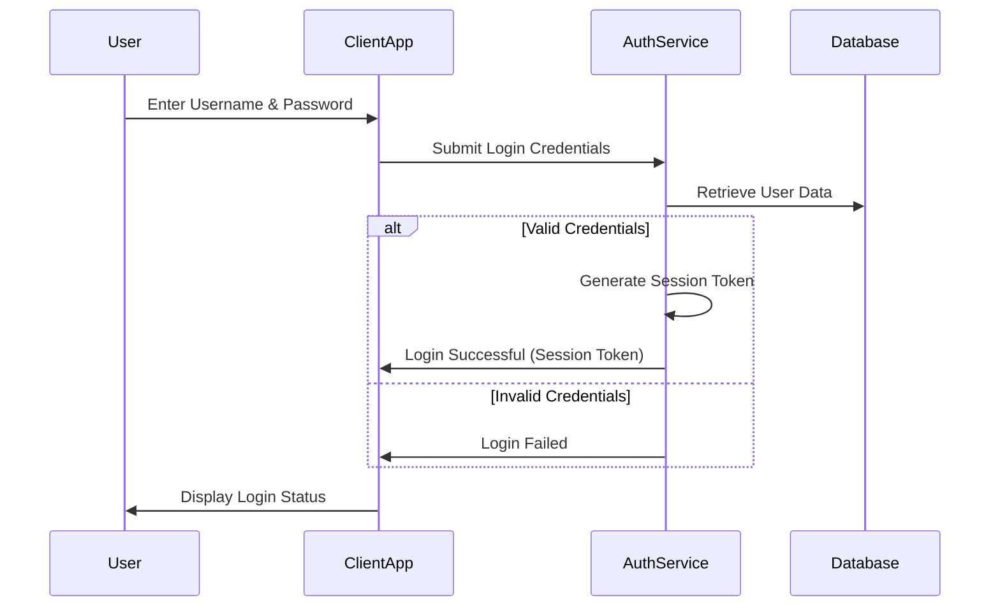
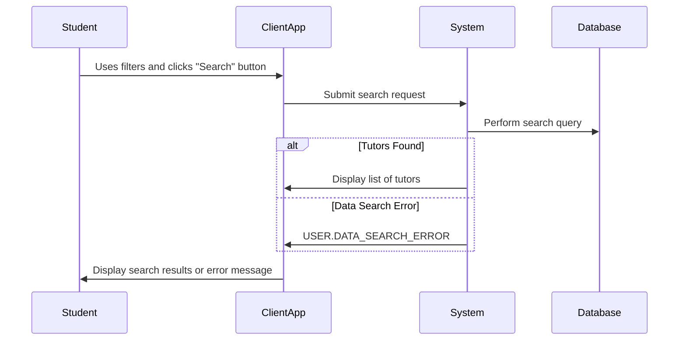
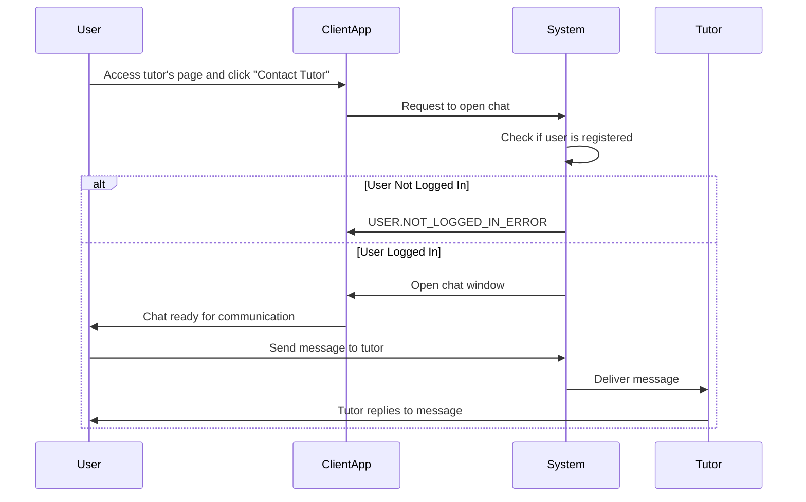

## Use cases

## Student Sequence Diagrams

### Student Registration

```mermaid
sequenceDiagram
    participant User
    participant ClientApp
    participant AuthService
    participant Database

    User->>ClientApp: Fill Registration Form
    ClientApp->>AuthService: Submit Registration Data
    AuthService->>Database: Check if User Exists
    alt User Exists
        AuthService->>ClientApp: HTTP 400 Bad Request (User Already Registered)
    else New User
        AuthService->>Database: Save New User Data
        Database-->>AuthService: User Saved
        AuthService->>ClientApp: HTTP 201 Created (Registration Successful)
    end
    ClientApp->>User: Display Registration Status
```

### Student Login

```mermaid
sequenceDiagram
    participant User
    participant ClientApp
    participant AuthService
    participant Database

    User->>ClientApp: Enter Username & Password
    ClientApp->>AuthService: Submit Login Credentials
    AuthService->>Database: Retrieve User Data
    alt Valid Credentials
        AuthService->>AuthService: Generate Session Token
        AuthService->>ClientApp: Login Successful (Session Token)
    else Invalid Credentials
        AuthService->>ClientApp: Login Failed
    end
    ClientApp->>User: Display Login Status
```

#### Student Search Tutor

```mermaid
sequenceDiagram
    participant Student
    participant ClientApp
    participant System
    participant Database

    Student->>ClientApp: Uses filters and clicks "Search" button
    ClientApp->>System: Submit search request
    System->>Database: Perform search query
    alt Tutors Found
        System->>ClientApp: Display list of tutors
    else Data Search Error
        System->>ClientApp: USER.DATA_SEARCH_ERROR
    end
    ClientApp->>Student: Display search results or error message
```

### Student Contact Tutor

```mermaid
sequenceDiagram
    participant User
    participant ClientApp
    participant System
    participant Tutor

    User->>ClientApp: Access tutor's page and click "Contact Tutor"
    ClientApp->>System: Request to open chat
    System->>System: Check if user is registered
    alt User Not Logged In
        System->>ClientApp: USER.NOT_LOGGED_IN_ERROR
    else User Logged In
        System->>ClientApp: Open chat window
        ClientApp->>User: Chat ready for communication
        User->>System: Send message to tutor
        System->>Tutor: Deliver message
        Tutor->>User: Tutor replies to message
    end
```