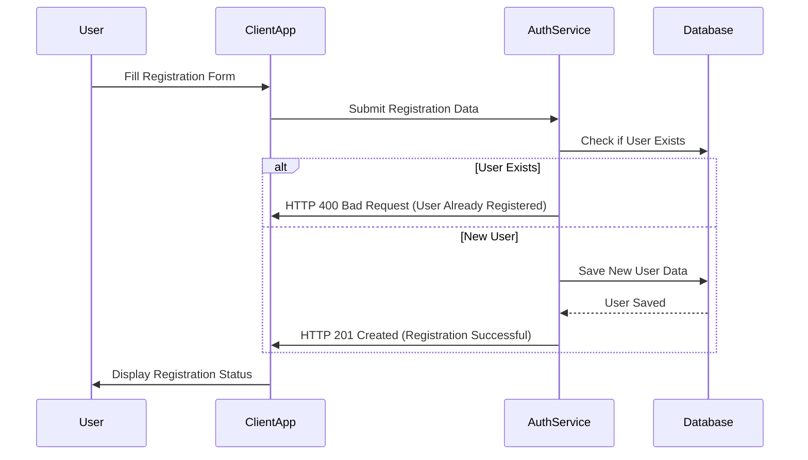
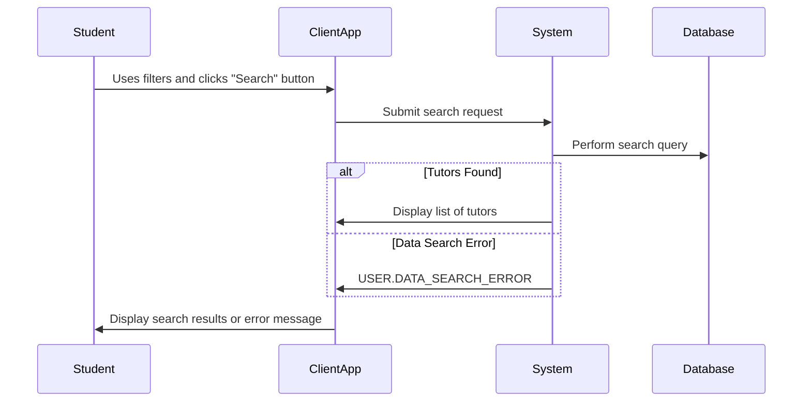
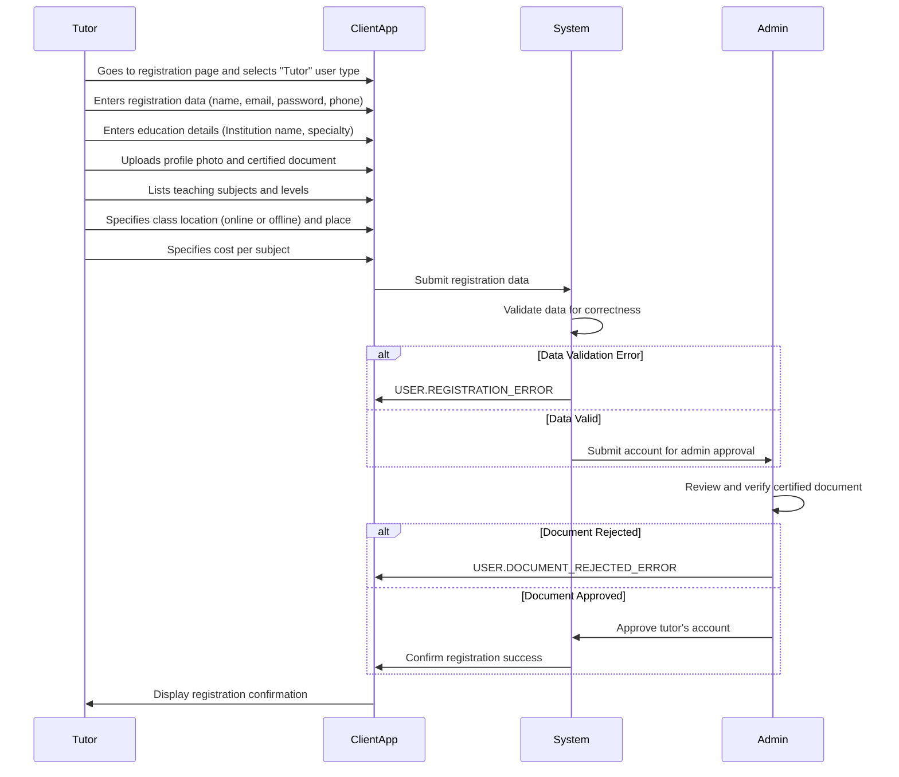
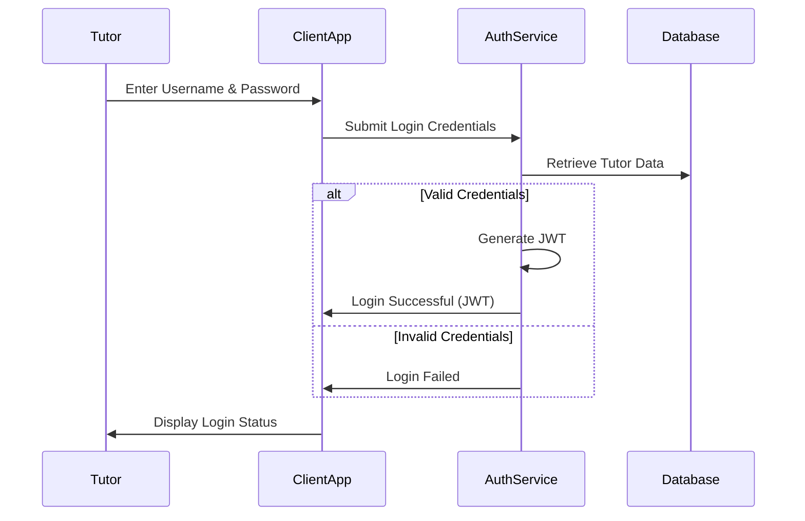
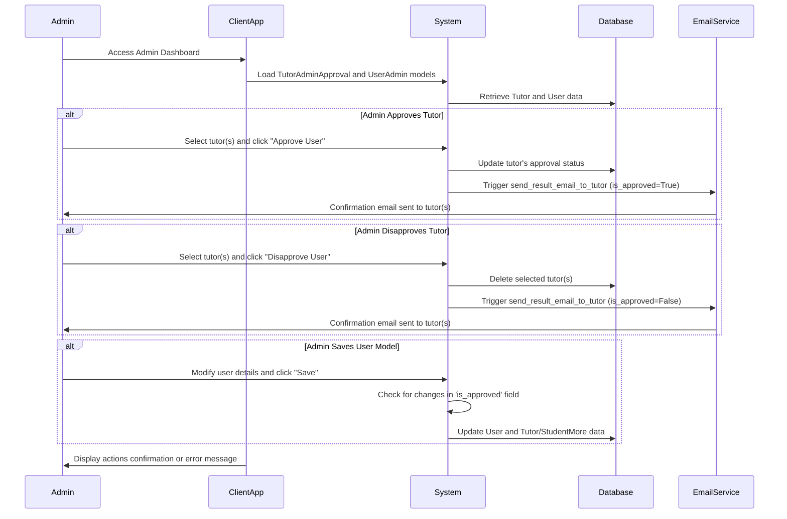

## Use cases

## Student Sequence Diagrams

### Student Registration

### Student Login

### Student Search Tutor

### Tutor Registration

### Tutor Login

### Admin Approve or Disapprove Tutor

