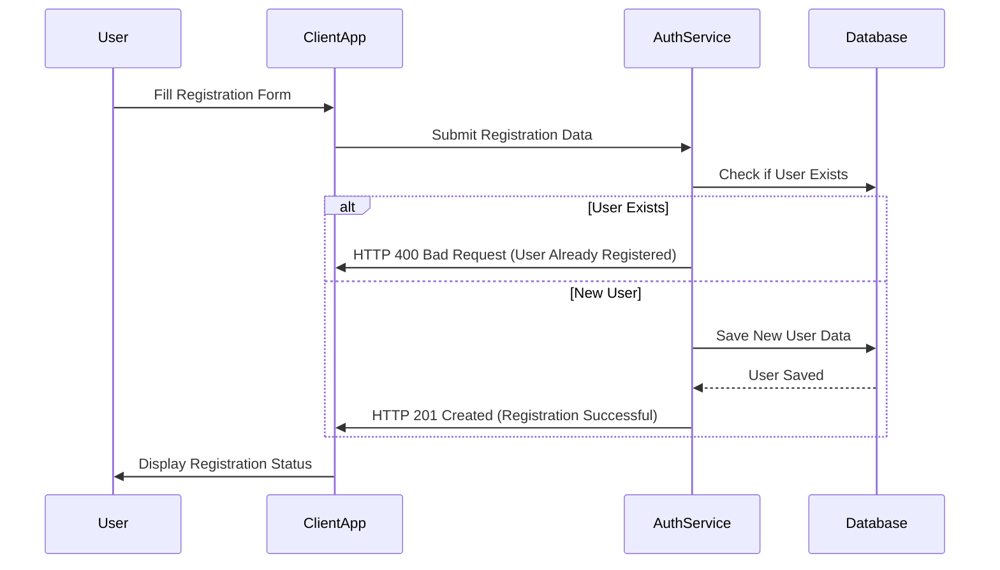
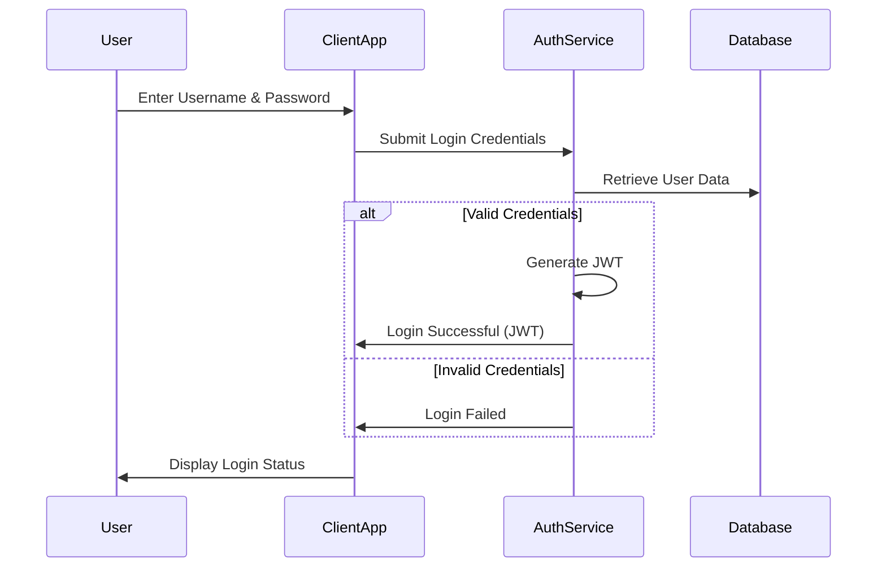
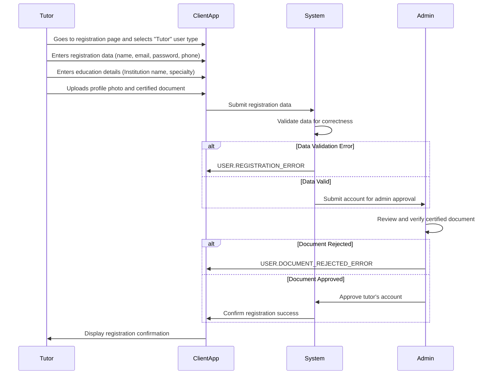
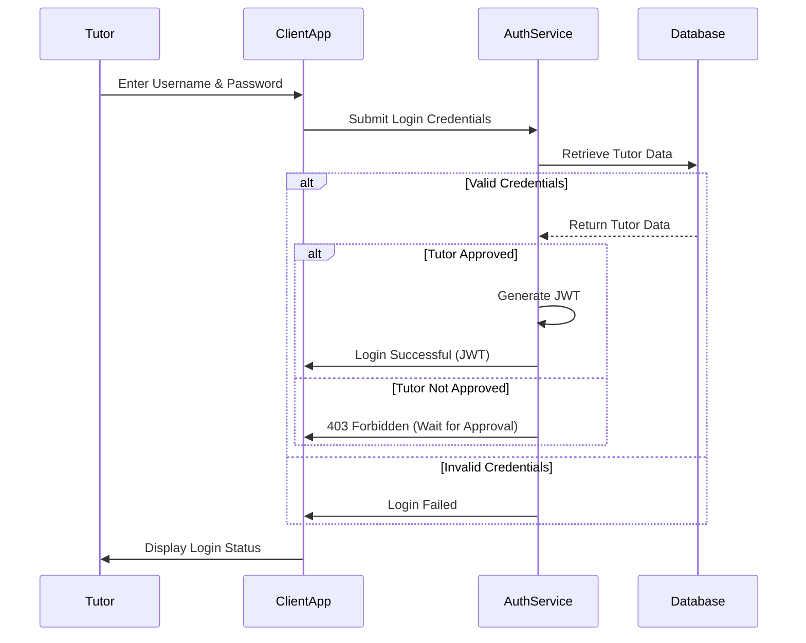
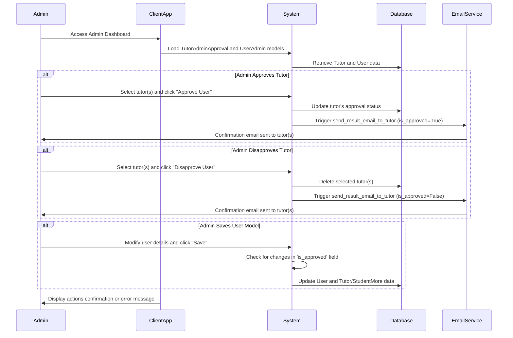
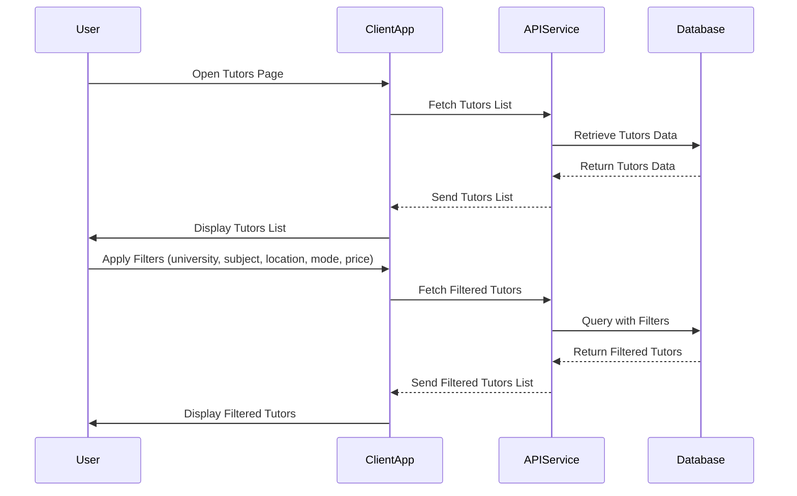

## Use cases

## Student Sequence Diagrams

### Student Registration

### Student Login

### Tutor Registration

### Tutor Login

### Admin Approve or Disapprove Tutor

### View Tutors and Use Filters (Unlogged User)
